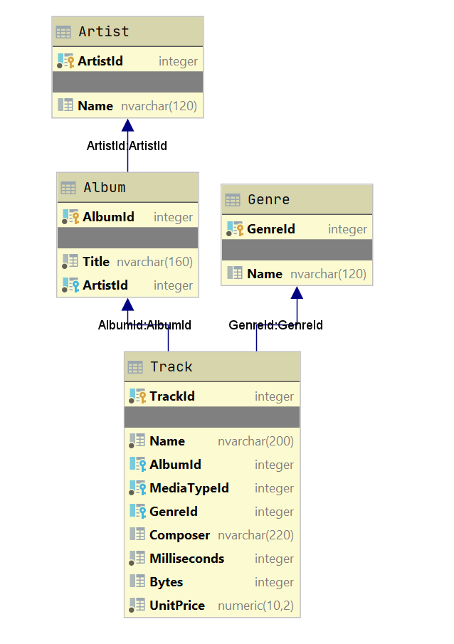

# Список альбомов

|Ограничение времени|Ограничение памяти|Ввод|Вывод|
|---|---|---|---|
|1 секунда|64Mb|стандартный ввод или input.txt|стандартный вывод или output.txt|

Снова вернемся к [базе данных музыкального магазина](https://github.com/lerocha/chinook-database). Нас будут интересовать не все таблицы, а только вот

эти:

Вашему приложению доступна база данных music_db.sqlite, в которой есть таблицы, соответствующие данной схеме.
Напишите программу, которая считывает название жанра, и выводит все названия альбомов, где есть хотя бы один трек в этом жанре. Альбомы необходимо выводить упорядоченно по id исполнителя, а затем по алфавиту, каждое название с новой строки.

## Формат ввода
Одна строка — название жанра.
## Формат вывода
Результат запроса — названия альбомов, каждое с новой строки.
## Примечания
Названия таблиц и полей в базе данных не чувствительны к регистру, то есть "ArtistId" то же, что "artistid".
