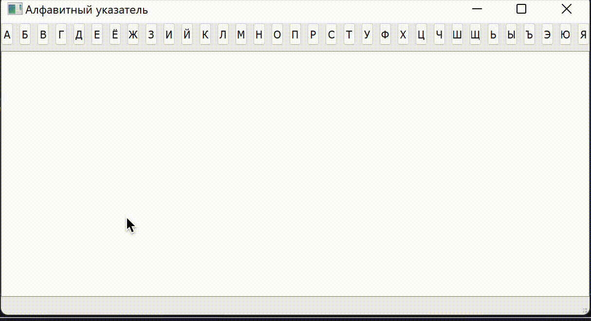

# Алфавитный указатель
Ограничение времени	10 секунд
Ограничение памяти	640.0 Мб
Ввод	стандартный ввод или input.txt
Вывод	стандартный вывод или output.txt
Напишите программу с графическим пользовательским интерфейсом для отображения информации о фильмах с фильтрацией по алфавиту. Расположите на форме виджет-layout, содержащий виджеты (QPushButton или любой другой подходящий) со всеми заглавными буквами русского алфавита. При нажатии на виджет с буквой должны отображаться фильмы, начинающиеся на эту букву. Дополнительно выводите количество фильмов в таблице после фильтрации, предусмотрите сообщение на случай, если ни одного фильма не найдено.

Назовите главный класс программы MyWidget.

Инициализируйте массив buttons как атрибут MyWidget и добавьте туда все кнопки в алфавитном порядке. Обработчик нажатия назначьте для каждой кнопки индивидуально.

Выводите в statusBar сообщение Нашлось {n} записей если в базе есть фильмы с такой первой буквой, или К сожалению, ничего не нашлось. Для этого используйте виджет QStatusBar, который уже есть в классе QMainWindow, он называется statusbar. Для получения доступа к этому виджету используйте метод statusBar класса QMainWindow.

Таблицу для вывода информации о фильмах назовите tableWidget. В ней должны быть столбцы: ID, Название, Год, Жанр, Продолжительность.
Используйте базу данных films_db.sqlite.