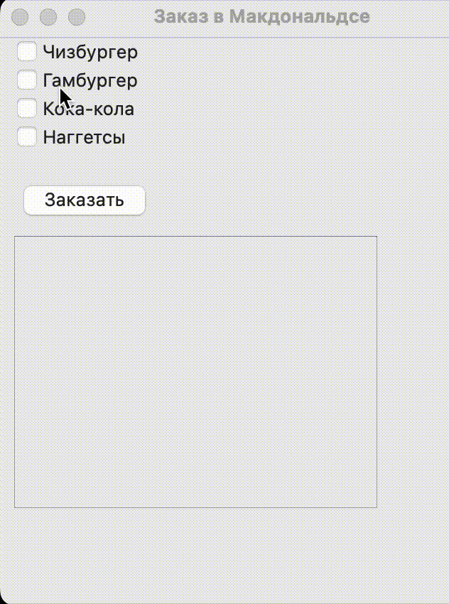

# Заказ в Макдональдсе

|Ограничение времени|Ограничение памяти|Ввод|Вывод|
|---|---|---|---|
|1 секунда|64Mb|стандартный ввод или input.txt|стандартный вывод или output.txt|

Напишите программу «Заказ в Макдональдсе» с графическим пользовательским интерфейсом на PyQT.

Пользователь должен иметь возможность выбирать одно или несколько блюд. После нажатия на кнопку «Заказать» в отдельном виджете должен отображаться «чек» с выбранными позициями.

Класс, реализующий окно приложения назовите MacOrder. Для выбора позиций используйте виджет QCheckBox. Храните список из чекбоксов в атрибуте menu_checkboxes объекта класса приложения.

Позиции в меню: "Чизбургер", "Гамбургер", "Кока-кола", "Наггетсы".

Кнопка заказа должна называться order_btn.

Заказ должен выводится в виджет QPlainTextEdit с названием result. Позиции в заказе должны выводится в том же порядке, как в меню. Текст заказа должен начинаться с «Ваш заказ:» и пустой строки.

