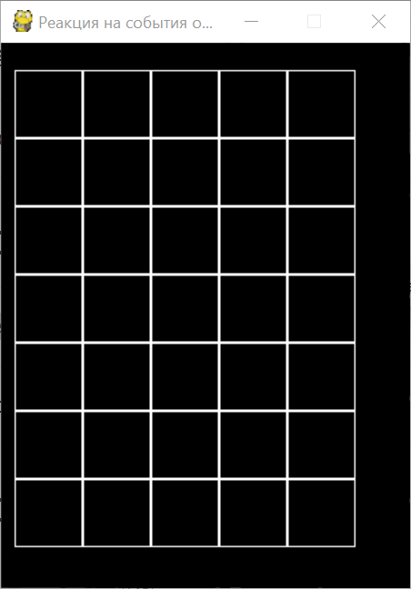

# Реакция на события от мыши

Добавьте в класс Board улучшенные методы обработки событий от мыши.

Реализуйте все три метода, рассмотренные на занятии.

При нажатиях на клетку её цвет должен последовательно чередоваться между чёрным, красным и синим.

