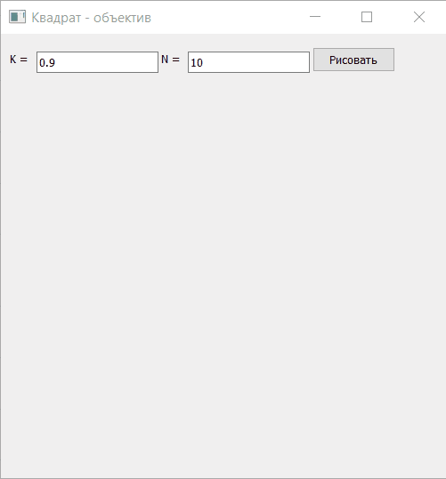

# Квадрат-объектив — 2

Напишите программу «Квадрат-объектив — 2». На экране нарисован квадрат. Пользователь в соответствующие поля вводит вещественное число k (< 1) — коэффициент масштабирования стороны и целое число n — количество повторений.

Каждая сторона квадрата делится в пропорции, соответствующей указанному коэффициенту, полученные точки соединяются и получается новый квадрат. Данная операция повторяется n раз. Например, если задать k = 0.8, а n = 20, результат должен получиться такой:

Самый большой квадрат должен идти из точки с координатами (150, 150) и иметь сторону 200

Класс, реализующий окно приложения, назовите Square2.

Поле для ввода числа k назовите k. Для числа n соответственно n

Цвет, которым вы будете рисовать квадраты сохраните в атрибуте color объекта класса приложения при инициализации в виде QColor.

Кнопку назовите draw

Размер окна приложения сделайте строго 500 пикселей по каждому измерению. Для изображения квадрата воспользуйтесь методом drawPolygon класса QPainter. Для создания объекта многоугольника, который передается методу drawPolygon, используйте класс QPolygonF. Для добавления точек в многоугольник используйте метод append. Все вычисления производите в вещественных числах, вещественные результаты вычислений передавайте конструктору класса QPointF - это точки - вершины многоугольника.