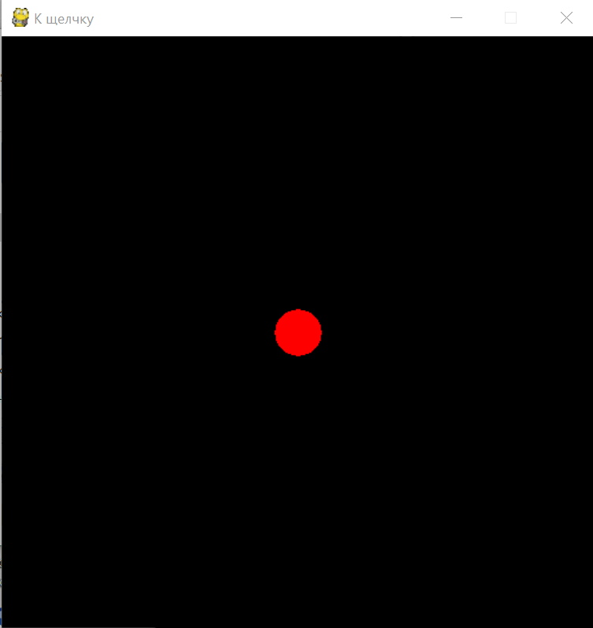

# К щелчку
Очень часто надо решать следующую игровую задачу: игровой персонаж должен по той или иной необходимости двигаться к определенному месту на игровом поле.

Давайте попробуем реализовать упрощённый вариант этой задачи.

Напишите программу, которая средствами Pygame создает окно размером 501×501 пиксель. В центре окна должен быть размещён красный кружок радиусом 20 пикселей.

При нажатии произвольной кнопки мышки кружок должен начать двигаться к месту «клика» с произвольной скоростью, причём сначала он должен выйти на «прямую» дорогу, а уже потом приблизиться к цели (смотрите гифку).

