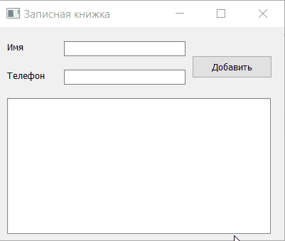

# Записная книжка

|Ограничение времени|Ограничение памяти|Ввод|Вывод|
|---|---|---|---|
|1 секунда|64Mb|стандартный ввод или input.txt|стандартный вывод или output.txt|

Напишите программу «Записная книжка» с графическим пользовательским интерфейсом на PyQT, используя необходимые виджеты.

Класс, реализующий это приложение назовите MyNotes.

Виджеты ввода имени и телефона должны являться QLineEdit и называться contactName и contactNumber соответственно.

Кнопку добавления контакта назовите addContactBtn.

Список котактов реализуйте через QListWidget и назовите contactList.



Пользователь должен иметь возможность ввести имя контакта и его номер. После добавление данные должны отображаться в списке.

### hints

Launch QTDesigner
```python
.venv/lib/python3.11/site-packages/qt5_applications/Qt/bin/designer
```
Turn UI design into Python
```python
pyuic5 design.ui -o design.py
```
The main answer have to include the generated code into one file.