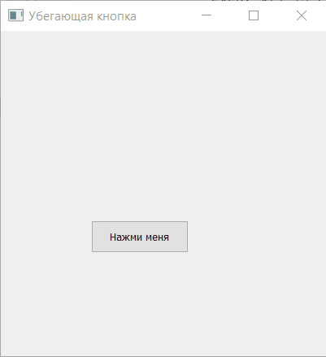

# Убегающая кнопка

Ограничение времени	10 секунд
Ограничение памяти	64.0 Мб
Ввод	стандартный ввод или input.txt
Вывод	стандартный вывод или output.txt
Напишите программу «Убегающая кнопка» с использованием виджетов PyQT. На форме произвольного размера располагается кнопка. Когда курсор мыши приближается к кнопке, она перемещается таким образом, чтобы нельзя было на неё нажать. Кнопка не должна исчезать с экрана (частично или полностью).

Назовите главный класс программы MyWidget.

У кнопки должно быть название button.
