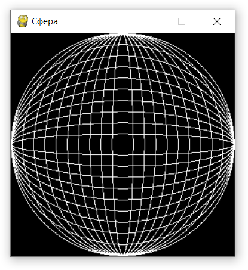

# Сфера
Напишите программу, которая считывает через стандартный поток ввода целое число n и рисует средствами библиотеки Pygame в окне 300×300 пикселей «проволочную» сферу из n горизонтальных и вертикальных белых эллипсов толщиной в 1 пиксель.

В случае, если пользователь ввел неверное значение (не целое число), программа должна печатать в командную строку сообщение «Неправильный формат ввода» и завершать работу.

Например, при вводе 10 должно появиться такое окно:
